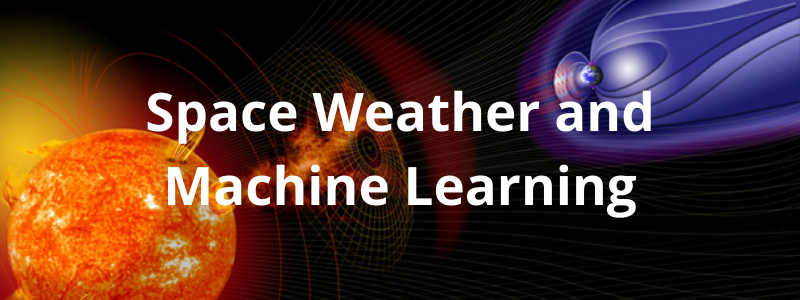
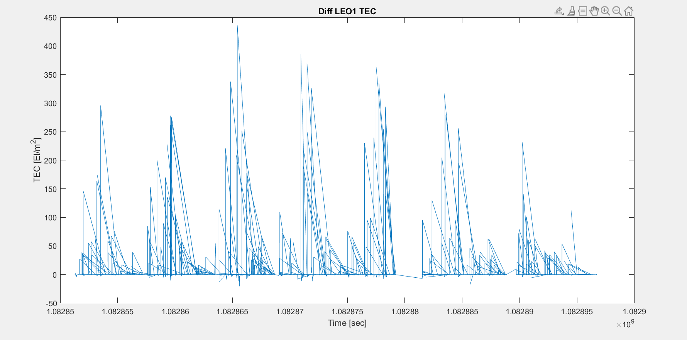

<!-- Banner -->

    
    The research project I completed at the University of Bath for my graduation thesis.

## About

This project takes a look at applying Machine Learning in the field of Space Weather. In particular, we are interested in it's applications in relation to forecasting.

## What's In This Repository?

This repository includes:

-   A research thesis
-   A logbook
-   Python files used during research
-   MATLAB files used during research

(Datasets are not included)
 
 

_Data visualisation produced by MATLAB code_

## Downloading The Datasets

The data files are too large to be included and have been therefore left out. You can download all the datasets for free from [UCAR COSMIC](https://www.cosmic.ucar.edu/what-we-do/cosmic-2/data/).

The datasets that were mainly used in this projects are the Absolute Total Electron Content datafiles.
